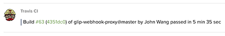
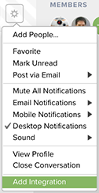
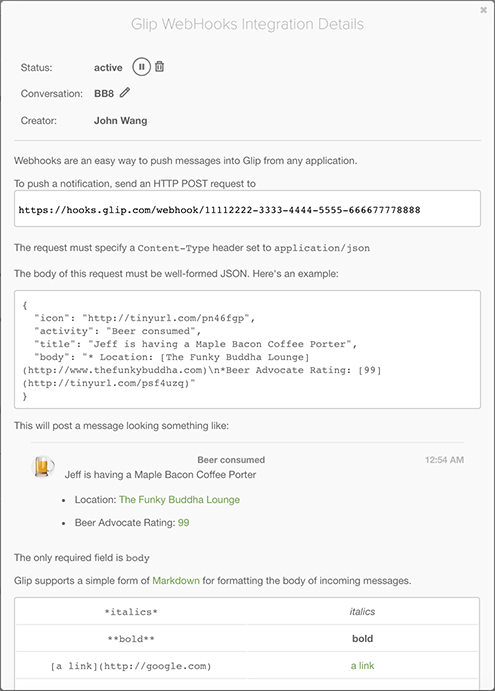

Chathooks - A webhook formatter for chat
========================================

[![Build Status][build-status-svg]][build-status-link]
[![Go Report Card][goreport-svg]][goreport-link]
[![Docs][docs-godoc-svg]][docs-godoc-link]
[![License][license-svg]][license-link]
[![Heroku][heroku-svg]][heroku-link]


# Overview

Chathooks is a webhook proxy service that converts generic outbound webhook messages to a canonical [CommonChat](https://github.com/commonchat) message format which is then sent to any chat / team messaging platform supported by the [CommonChat](https://github.com/grokify/commonchat) chat post abstraction library.

This is useful because:

* many services with outbound webhooks need to be formatted before they can be consumed by an inbound webhook. This proxy service does the conversion so you don't have to. The code is all open source so customizations can be done easily.
* the conversion can be done one time for all chat / team messaging solutions supported by CommonChat.
* one service can proxy an arbitrary number of webhook sources and event types so you don't have to configure multiple inbound webhooks going to the same group / channel.

See the following video to get started quickly:

* [Getting Started YouTube Video](https://youtu.be/H9nbsOmqrI8)

## Supported HTTP Engines

Chathooks supports multiple HTTP engines including the following:

* [net/http](https://golang.org/pkg/net/http/)
* [valyala/fasthttp](https://github.com/valyala/fasthttp)
* [aws/aws-lambda-go](https://github.com/aws/aws-lambda-go)
* ~~[eawsy/aws-lambda-go-shim](https://github.com/eawsy/aws-lambda-go-shim)~~

## Supported Webhook Formats

Multiple input webhook formats are supported via handlers. New ones can be easily created by using the `handlers.Handler` interface.

1. [Aha!](https://support.aha.io/hc/en-us/articles/202000997-Integrate-with-Webhooks)
1. [AppSignal](http://docs.appsignal.com/application/integrations/webhooks.html)
1. [Apteligent/Crittercism]()
1. [Circle CI](https://circleci.com/docs/1.0/configuration/#notify)
1. [Codeship](https://documentation.codeship.com/basic/getting-started/webhooks/)
1. [Confluence](https://developer.atlassian.com/static/connect/docs/beta/modules/common/webhook.html)
1. [Datadog](http://docs.datadoghq.com/integrations/webhooks/)
1. [Desk.com](https://support.desk.com/customer/portal/articles/869334-configuring-webhooks-in-desk-com-apps)
1. [Enchant](https://dev.enchant.com/webhooks)
1. [GoSquared](https://www.gosquared.com/customer/portal/articles/1996494-webhooks)
1. [Heroku](https://devcenter.heroku.com/articles/deploy-hooks#http-post-hook)
1. [Librato](https://www.librato.com/docs/kb/alert/service_integrations/webhook/)
1. [Magnum CI](https://github.com/magnumci/documentation/blob/master/webhooks.md)
1. [Marketo](http://developers.marketo.com/webhooks/)
1. [OpsGenie](https://docs.opsgenie.com/docs/webhook-integration)
1. [Papertrail](http://help.papertrailapp.com/kb/how-it-works/web-hooks/)
1. [Pingdom](https://www.pingdom.com/resources/webhooks)
1. [Raygun](https://raygun.com/docs/integrations/webhooks)
1. [Runscope](https://www.runscope.com/docs/api-testing/notifications#webhook)
1. [Semaphore CI](https://semaphoreci.com/docs/post-build-webhooks.html), [Deploy](https://semaphoreci.com/docs/post-deploy-webhooks.html)
1. [StatusPage](https://help.statuspage.io/knowledge_base/topics/webhook-notifications)
1. [Travis CI](https://docs.travis-ci.com/user/notifications#Configuring-webhook-notifications)
1. [Userlike](https://www.userlike.com/en/public/tutorial/addon/api)
1. [VictorOps](https://help.victorops.com/knowledge-base/custom-outbound-webhooks/)

Here is an exmaple Webhook Message from Travis CI formatted for Glip.



The above are "outbound" webhook formats from the perspective of the service providing the events.

A special webhook format supported is the Slack "inbound" webhook format. This format message isn't sent by Slack but is accepted by Slack. It is useful to allow modification of messages already formatted for Slack.

* [Slack](https://api.slack.com/incoming-webhooks)

## Supported Chat Services

Chathooks can post messages to any service supported by [CommonChat](https://github.com/grokify/commonchat). New services can be added by creating an adapter using the `commonchat.Adapter` interface.

Note: The emoji to URL is designed to take a `icon_emoji` value and convert it to a URL. `EmojiURLFormat` is a [`fmt`](https://golang.org/pkg/fmt/) `format` string with one `%s` verb to represent the emoji string without `:`. You can use any emoji image service. The example shows the emoji set from [github.com/wpeterson/emoji](https://github.com/wpeterson/emoji) forked and hosted at [grokify.github.io/emoji/](https://grokify.github.io/emoji/).

# Installation

## Local

```
$ go get github.com/grokify/chathooks
```

## Heroku

[](https://heroku.com/deploy)

or

```sh
$ heroku create
$ git push heroku master
$ heroku open
```

## AWS Lambda

The following will generate a `main.zip` file to upload to AWS Lambda.

```
$ go get github.com/grokify/chathooks
$ cd chathooks
$ sh aws-package.sh
$ ls main.zip
```

# Configuration

## Environment Variables

Chathooks uses two environment variables:

| Variable Name | Value |
|---------------|-------|
| `CHATHOOKS_ENGINE` | The engine to be used: `awslambda` for `aws/aws-lambda-go`, `nethttp` for `net/http` and `fasthttp` for `valyala/fasthttp`. Leave empty for `eawsy/aws-lambda-go-shim` as it does not require a server to be started. |
| `CHATHOOKS_TOKENS` | Comma-delimited list of verification tokens. No extra leading or trailing spaces. |

## Using the `net/http` and `fasthttp` Engines

1. To adjust supported handlers, edit server.go to add and remove handlers.
1. TSt the `CHATHOOKS_ENGINE` environment variable to `nethttp` or `fasthttp`.
1. Start the service in `main.go`.

For testing purposes, use:

```bash
$ go run main.go
```

For production services, compile and run the binary:

```bash
$ go build main.go
$ ./main
```

## Using the AWS Engine

To use the AWS Lambda engine, you need an AWS account. If you don't hae one, the [free trial account](https://aws.amazon.com/s/dm/optimization/server-side-test/free-tier/free_np/) includes 1 million free Lambda requests per month forever and 1 million free API Gateway requests per month for the first year.

### Installing using the AWS Lambda UI


### Installation via AWS Lambda

See the AWS docs for deployment:

https://docs.aws.amazon.com/lambda/latest/dg/lambda-go-how-to-create-deployment-package.html

Using the [`aws-cli`](https://aws.amazon.com/cli/) you can use the following approach:

```
$ GOOS=linux go build main.go
$ zip main.zip ./main
# --handler is the path to the executable inside the .zip
$ aws lambda create-function \
  --region region \
  --function-name Chathook \
  --memory 128 \
  --role arn:aws:iam::account-id:role/execution_role \
  --runtime go1.x \
  --zip-file fileb://main.zip \
  --handler main
```

You can use the `aws-package.sh` shell script to package your handler.

Note: you can install the `aws-cli` using the appropriate command below:

```
$ pip install awscli
$ pip3 install awscli
```

After installation, you may need to add your Python `bin` directory to your path. The following are examples for OS X.

```
$ export PATH=$PATH:/Users/~/Library/Python/2.7/bin
$ export PATH=$PATH:/Library/Frameworks/Python.framework/Versions/3.6/bin
```

### Update Lambda Code:

You can update the Lambda function code using the following:

https://docs.aws.amazon.com/cli/latest/reference/lambda/update-function-code.html

`$ aws lambda update-function-code --function-name='MyFunction' --zip-file='fileb://main.zip' --publish --region='us-east-1'`

The `aws-update.sh` file has this command with default settings.

Make sure to set your AWS credentials file.

### Manual Setup

* Configure AWS Lambda Function
  1. Create AWS Lambda function
  2. Set `CHATHOOKS_ENGINE` to `aws`
  3. Set `CHATHOOKS_TOKEN` as desired
  4. Set Handler to `main`
* Configure API Gateway
  1. Create "REST" API
  2. Select "New API"
  3. Select "Actions" > "Create Resource"
  4. Click "Configure as proxy resource"
  5. Use Resource Path `{proxy+}`
  6. Click "Enable API Gateway CORS"
  7. Click "Create Resource"
  8. Leave "Integration Type" as "Lambda Function Proxy"
  8. In "Lambda Function", paste in your Lamda ARN
  10. Click "Deploy API" and create stage if necessary.

### Troubleshooting

401 Unauthorized Error. If you can run a test on API Gateway and have deployed your API but are running into a 401 Unauthorized error.....

# Usage

## Creating the Glip Webhook

1. create a Glip webhook
2. use webhook URL's GUID to create the proxy URL as shown below
3. use the proxy URL in your outbound webhook service

| Query Parameter | Required? | URL |
|-----------------|-----------|-----|
| `inputType` | required | An handler service like `marketo` |
| `outputType` | required | An adapter service like `glip` |
| `url` | required | A webhook URL or UID, e.g. `11112222-3333-4444-5555-666677778888` |
| `token` | optional | Must be included if service is configured to use auth tokens |

The webhook proxy URLs support both inbound and outbound formats. When available, these should be represented in the handler key.

To create the Glip webhook and receive a webhook URL do the following:

### Add the Webhook Integration

At the top of any conversation page, click the Settings gear icon and then click `Add Integration`.



Select the `Glip Webhooks` integration.


### Get the Webhook URL

Once you get the URL, the proxy URL is created by appending the GUID (e.g. `1112222-3333-4444-5555-666677778888`) to the proxy URL base, `hooks?inputType=slack&outputType=glip` (e.g. `https://glip-proxy.example.com/hooks?inputType=slack&outputType=glip&url=1112222-3333-4444-5555-666677778888`). Use the proxy URL in the app that is posting the Slack webhook and the payload will be sent to Glip.



# Extending

## Adding Handlers

The easiest way to add a handler is to inspect the code of an existing handler and build something similar. It needs satisfy the `handlers.Handler` interface.

# Notes

## Maintenance

Rebuild `vendor` directory with:

```
$ godep save ./...
```

More information on deploying Go on Heroku here:

* https://devcenter.heroku.com/articles/go-support

### Heroku

Set up your own Go app on Heroku easily using [`goheroku`](https://github.com/grokify/goheroku).


## Credits

Chathooks is built using:

* [net/http](https://golang.org/pkg/net/http/)
* [valyala/fasthttp](https://github.com/valyala/fasthttp)
* [aws/aws-lambda-go](https://github.com/aws/aws-lambda-go)

* [buaazp/fasthttprouter](https://github.com/buaazp/fasthttprouter)
* [sirupsen/logrus](https://github.com/sirupsen/logrus)

 [build-status-svg]: https://api.travis-ci.org/grokify/chathooks.svg?branch=master
 [build-status-link]: https://travis-ci.org/grokify/chathooks
 [coverage-status-svg]: https://coveralls.io/repos/grokify/chathooks/badge.svg?branch=master
 [coverage-status-link]: https://coveralls.io/r/grokify/chathooks?branch=master
 [goreport-svg]: https://goreportcard.com/badge/github.com/grokify/chathooks
 [goreport-link]: https://goreportcard.com/report/github.com/grokify/chathooks
 [codeclimate-status-svg]: https://codeclimate.com/github/grokify/chathooks/badges/gpa.svg
 [codeclimate-status-link]: https://codeclimate.com/github/grokify/chathooks
 [docs-godoc-svg]: https://img.shields.io/badge/docs-godoc-blue.svg
 [docs-godoc-link]: https://godoc.org/github.com/grokify/chathooks
 [license-svg]: https://img.shields.io/badge/license-MIT-blue.svg
 [license-link]: https://github.com/grokify/chathooks/blob/master/LICENSE.md
 [heroku-svg]: https://img.shields.io/badge/%E2%86%91_deploy-Heroku-7056bf.svg?style=flat
 [heroku-link]: https://heroku.com/deploy
