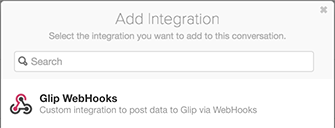

Glip Webhook Proxy
==================

[![Build Status][build-status-svg]][build-status-link]
[![Go Report Card][goreport-svg]][goreport-link]
[![Code Climate][codeclimate-status-svg]][codeclimate-status-link]
[![Docs][docs-godoc-svg]][docs-godoc-link]
[![License][license-svg]][license-link]

Proxy service to map different requests to Glip's inbound webhook service. This is useful because various chat services have similar, but slightly different inbound webhook services. With slight modifications, applications already integrated with Slack and create messages on Glip simply by using the proxy URL.

This proxy currently supports converting Slack webhook messages to Glip webhooks. Setting up this service will allow you to use proxy URLs in services that support Slack to post into Glip. It currently:

* handles all request content types
* converts payload property names
* converts emoji to URL
* is tested with community Slack SDK

Note: At this time, the proxy only supports the `text` body and not message attachments yet.

## Installation

```
$ go get github.com/grokify/glip-webhook-proxy
```

## Usage

### Starting the Service

Start the service with the following.

```go
package main

import (
	"github.com/grokify/glip-webhook-proxy"
)

func main() {
	config := glipwebhookproxy.Configuration{
		Port:           8080,
		EmojiURLPrefix: "https://grokify.github.io/emoji/assets/images/",
		EmojiURLSuffix: ".png"}

	glipwebhookproxy.StartServer(config)
}
```

Note: The emoji to URL is designed to take a `icon_emoji` value and convert it to a URL. You can use any emoji image service. The example shows the emoji set from [github.com/wpeterson/emoji](https://github.com/wpeterson/emoji) forked and hosted at [grokify.github.io/emoji/](https://grokify.github.io/emoji/).

You can run the above by saving it to a file `start.go` and then running `$ go run start.go`.

### Creating the Glip Webhook

1. create a Glip webhook
2. use webhook URL's GUID to create the proxy URL as shown below
3. use the proxy URL in your outbound webhook service

| Name | Value |
|------|-------|
| Glip Webhook URL | `https://hooks.glip.com/webhook/11112222-3333-4444-5555-666677778888` |
| Proxy Webhook URL | `https://example.com/slack/glip/11112222-3333-4444-5555-666677778888` |

To create the Glip webhook and receive a webhook URL do the following:

#### Add the integration




#### Get the Webhook URL

Once you get the URL, the proxy URL is created by appending the GUID (e.g. `1112222-3333-4444-5555-666677778888`) to the proxy URL base, e.g. `/slack/glip`. Use the proxy URL in the app that is posting the Slack webhook and the payload will be sent to Glip.


## Example Requests

Most of the time you will likely either:

* use the proxy URL in an outbound webhook service that supports the Slack format or
* use a client library

The following examples are provided for reference and testing.

### Using `application/json`

```
curl -X POST \
  -H "Content-Type: application/json" \
  -d '{"username":"ghost-bot", "icon_emoji": ":ghost:", "text":"BOO!"}' \
  "http://localhost:8080/slack/glip/11112222-3333-4444-5555-666677778888"
```

### Using `application/x-www-form-urlencoded`

```
curl -X POST \
  --data-urlencode 'payload={"username":"ghost-bot", "icon_emoji": ":ghost:", text":"BOO!"}' \
  "http://localhost:8080/slack/glip/11112222-3333-4444-5555-666677778888"
```

### Using `multipart/form-data`

```
curl -X POST \
  -F 'payload={"username":"ghost-bot", "icon_emoji": ":ghost:", text":"BOO!"}' \
  "http://localhost:8080/slack/glip/11112222-3333-4444-5555-666677778888"
```

### Using Community Ruby SDK

This has been tested using:

* [https://github.com/rikas/slack-poster](https://github.com/rikas/slack-poster)

```ruby
require 'slack/poster'

url = 'http://localhost:8080/slack/glip/11112222-3333-4444-5555-666677778888'

opts = {
	username: "Ghost Bot [Bot]",
	icon_emoji: ':ghost:'
}

poster = Slack::Poster.new url, opts
poster.send_message 'BOO!'
```

## Notes

Glip Webhook Proxy is built using:

* [https://github.com/valyala/fasthttp](https://github.com/valyala/fasthttp)
* [https://github.com/buaazp/fasthttprouter](https://github.com/buaazp/fasthttprouter)

 [build-status-svg]: https://api.travis-ci.org/grokify/glip-webhook-proxy.svg?branch=master
 [build-status-link]: https://travis-ci.org/grokify/glip-webhook-proxy
 [goreport-svg]: https://goreportcard.com/badge/github.com/grokify/glip-webhook-proxy
 [goreport-link]: https://goreportcard.com/report/github.com/grokify/glip-webhook-proxy
 [codeclimate-status-svg]: https://codeclimate.com/github/grokify/glip-webhook-proxy/badges/gpa.svg
 [codeclimate-status-link]: https://codeclimate.com/github/grokify/glip-webhook-proxy
 [docs-godoc-svg]: https://img.shields.io/badge/docs-godoc-blue.svg
 [docs-godoc-link]: https://godoc.org/github.com/grokify/glip-webhook-proxy
 [license-svg]: https://img.shields.io/badge/license-MIT-blue.svg
 [license-link]: https://github.com/grokify/glip-webhook-proxy/blob/master/LICENSE.mds
